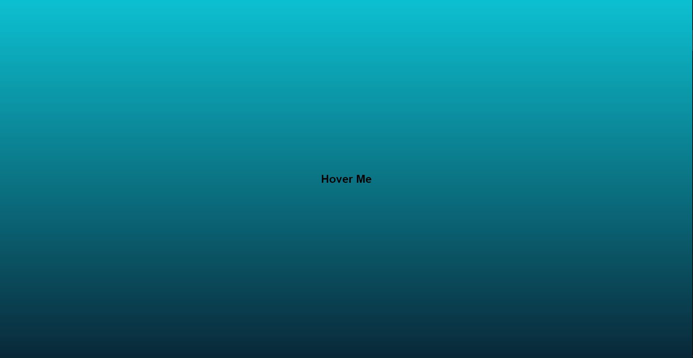
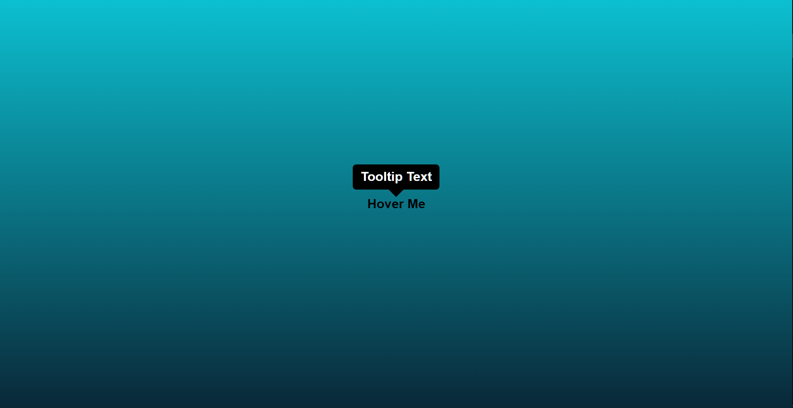

# Tooltip

- made by HTML and CSS

### A tooltip is a graphical user interface (GUI) element used in conjunction with the cursor or mouse pointer to display information about an item without needing to click on it

## First Look :

## After Going to text and hover like :

---

👋 Hello, I'm Rahul Saini.

🚀 Follow Me:

- [Twitter](https://twitter.com/rahumeetawa)
- [LinkedIn](https://www.linkedin.com/in/rahul-saini-3950501a2/)

---
